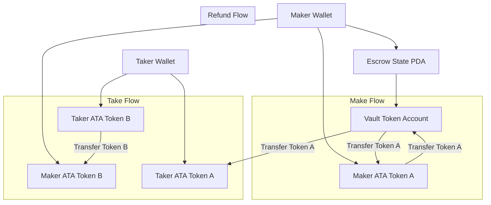

# Solana Escrow Program

A secure, decentralized escrow system built on Solana using the Anchor framework. This program enables trustless token swaps between two parties through an escrow mechanism, allowing users to trade SPL tokens safely without requiring a trusted intermediary.

## Table of Contents

- [Solana Escrow Program](#solana-escrow-program)
  - [Table of Contents](#table-of-contents)
  - [Program ID](#program-id)
  - [Overview](#overview)
  - [Architecture](#architecture)
  - [Instructions](#instructions)
    - [Make](#make)
    - [Take](#take)
    - [Refund](#refund)
  - [Security Features](#security-features)
  - [Testing](#testing)
    - [Running Tests](#running-tests)
  - [Technical Details](#technical-details)
    - [Account Space Calculation](#account-space-calculation)
    - [Cross-Program Invocation (CPI)](#cross-program-invocation-cpi)
    - [PDA Signing](#pda-signing)
  - [Development Setup](#development-setup)
  - [Usage](#usage)
    - [Create Escrow](#create-escrow)
    - [Take Escrow](#take-escrow)
    - [Refund Escrow](#refund-escrow)
  - [Technical Design](#technical-design)
    - [Account Structure](#account-structure)
    - [Key Components](#key-components)
  - [Trade Flow](#trade-flow)
  - [License](#license)
  - [Contributing](#contributing)

## Program ID

Devnet: `[Your Program ID Here]`

## Overview

The Escrow program provides a secure, trustless mechanism for token swaps between two parties:
- **Maker**: Initiates the trade by depositing Token A and specifying the desired amount of Token B
- **Taker**: Completes the trade by providing Token B and receiving Token A
- **Escrow**: Holds Token A securely until the trade is completed or refunded

The program supports all SPL tokens and Token-2022 extensions, ensuring compatibility with the entire Solana token ecosystem.

## Architecture

The program uses three main components per trade:

1. **Escrow State Account**: Stores trade metadata and parameters
   - Seeds: `["escrow", maker_pubkey, seed]`
   - Stores: maker, mint_a, mint_b, receive amount, bump seeds

2. **Vault Token Account**: Holds the escrowed Token A
   - Associated Token Account owned by the Escrow PDA
   - Temporarily holds maker's tokens until trade completion

3. **Seed Parameter**: Unique identifier allowing multiple concurrent trades per maker

## Instructions

### Make

Creates an escrow and deposits Token A for trading.

**Accounts:**
- `maker`: Signer who creates the escrow and deposits Token A
- `mint_a`: Mint account of the token being offered
- `mint_b`: Mint account of the token being requested
- `maker_ata_a`: Maker's associated token account for Token A
- `escrow`: PDA storing escrow metadata
- `vault`: Token account holding the escrowed Token A
- `token_program`: SPL Token program
- `associated_token_program`: Associated Token program
- `system_program`: System program

**Parameters:**
- `seed`: Unique identifier for the escrow (u64)
- `amount`: Amount of Token A to deposit
- `receive`: Amount of Token B requested in exchange

### Take

Completes the trade by providing Token B and receiving Token A.

**Accounts:**
- `taker`: Signer who completes the trade
- `maker`: Original creator of the escrow
- `mint_a`: Mint account of Token A (being received)
- `mint_b`: Mint account of Token B (being provided)
- `taker_ata_a`: Taker's ATA for Token A (may be created)
- `taker_ata_b`: Taker's ATA for Token B (source of payment)
- `maker_ata_b`: Maker's ATA for Token B (may be created)
- `escrow`: Escrow state account
- `vault`: Token account holding escrowed Token A
- `token_program`: SPL Token program
- `associated_token_program`: Associated Token program
- `system_program`: System program

**Parameters:** None (amounts are stored in escrow state)

### Refund

Allows the maker to cancel the trade and recover their Token A.

**Accounts:**
- `maker`: Signer and original creator of the escrow
- `mint_a`: Mint account of Token A being refunded
- `maker_ata_a`: Maker's ATA for Token A (destination)
- `escrow`: Escrow state account to be closed
- `vault`: Token account holding escrowed Token A
- `token_program`: SPL Token program
- `associated_token_program`: Associated Token program
- `system_program`: System program

**Parameters:** None

## Security Features

- **Trustless Design**: No intermediary required; smart contract handles all logic
- **PDA Security**: Uses Program Derived Addresses to prevent unauthorized access
- **Atomic Swaps**: Trade completes atomically or fails entirely
- **Signer Validation**: All operations require appropriate signatures
- **Token Interface Support**: Compatible with SPL Token and Token-2022
- **Rent Recovery**: Closing escrow returns all rent to maker
- **Validation Constraints**: `has_one` constraints prevent account substitution attacks

## Testing

The program includes comprehensive tests covering all three instructions:

1. **Make Test**: Creates escrow and deposits Token A
2. **Take Test**: Completes the trade successfully
3. **Refund Test**: Cancels trade and refunds Token A

### Running Tests

```bash
anchor test
```

## Technical Details

### Account Space Calculation

The `Escrow` struct uses:
- 8 bytes: Anchor account discriminator
- 8 bytes: `seed` (u64)
- 32 bytes: `maker` (Pubkey)
- 32 bytes: `mint_a` (Pubkey)
- 32 bytes: `mint_b` (Pubkey)
- 8 bytes: `receive` (u64)
- 1 byte: `bump` (u8)
- **Total**: 121 bytes

### Cross-Program Invocation (CPI)

The program uses CPI for all token operations:
- **Make**: Transfer from maker to vault using `transfer_checked`
- **Take**: Transfer from taker to maker, then vault to taker using `transfer_checked`
- **Refund**: Transfer from vault to maker using `transfer_checked`
- **Cleanup**: Close vault account using `close_account`

### PDA Signing

For take and refund operations, the program uses the escrow's bump seed:

```rust
let signer_seeds: &[&[&[u8]]; 1] = &[&[
    b"escrow",
    self.maker.key.as_ref(),
    &self.escrow.seed.to_le_bytes()[..],
    &[self.escrow.bump],
]];
```

## Development Setup

1. Install Anchor CLI
2. Clone the repository
3. Install dependencies:
   ```bash
   yarn install
   ```
4. Build the program:
   ```bash
   anchor build
   ```
5. Deploy to devnet:
   ```bash
   anchor deploy --provider.cluster devnet
   ```

## Usage

### Create Escrow

Transaction: [Make Offer](https://explorer.solana.com/tx/3vP9HSjyns98ertsWXotrrEYreAJBeg317ibGnrkf16X3M6E821u25WU2eb93DozUHv9HNwreEeHgcsXdYVWZCBg?cluster=devnet)

```typescript
const seed = new anchor.BN(Date.now()); // Unique seed
const depositAmount = new anchor.BN(1000000); // 1 token (assuming 6 decimals)
const receiveAmount = new anchor.BN(2000000); // 2 tokens requested

const [escrowPda, _] = PublicKey.findProgramAddressSync(
  [
    Buffer.from("escrow"),
    maker.publicKey.toBuffer(),
    SEED.toArrayLike(Buffer, "le", 8)
  ],
  programId
);

const accounts = {
  maker: maker.publicKey,
  taker: taker.publicKey,
  mintA: mintA.publicKey,
  mintB: mintB.publicKey,
  makerAtaA,
  makerAtaB,
  takerAtaA,
  takerAtaB,
  escrowPda,
  vault,
  tokenProgram
}

await program.methods
  .make(seed, depositAmount, receiveAmount)
  .accounts({ ...accounts })
  .signers([maker])
  .rpc();
```

### Take Escrow

Transaction: [Take Offer](https://explorer.solana.com/tx/59QkayJRVmr9FL6tXoa2fnUTeT1sDT7VXijCJMch9JiPYmw4bKdszbNb4Km3zd4Kbbh9Wjz8A9PX5wk891WyUGzg?cluster=devnet)

```typescript
await program.methods
  .take()
  .accounts({ ...accounts })
  .signers([taker])
  .rpc();
```

### Refund Escrow

Transaction: [Refund Escrow](https://explorer.solana.com/tx/4sENgK327JvoBFLrTdj4mGLZ2ebrtgy6EhN6qVmHY4cFNmDf3dWb6bVdTyktQ9rSasH5wCmaEVkzPpVPUrjwS6vB?cluster=devnet)
```typescript
await program.methods
  .refund()
  .accounts({ ...accounts })
  .signers([maker])
  .rpc();
```

## Technical Design

### Account Structure



### Key Components

1. **Escrow State Account**
   - Stores trade parameters (amounts, mints, participants)
   - 121 bytes storage with security constraints
   - PDA derivation ensures unique trades per maker

2. **Vault Token Account**
   - Temporarily holds Token A during escrow period
   - Owned by Escrow PDA for security
   - Closed after trade completion or refund

3. **Security Model**
   - PDA-based access control
   - Atomic transaction execution
   - Comprehensive validation with `has_one` constraints
   - Cross-program invocation with program-derived signatures

## Trade Flow

1. **Maker Creates Escrow**:
   - Deposits Token A into vault
   - Specifies desired Token B amount
   - Escrow becomes publicly discoverable

2. **Taker Completes Trade**:
   - Provides required Token B to maker
   - Receives Token A from vault
   - Vault and escrow accounts closed

3. **Alternative: Maker Refunds**:
   - Maker can cancel anytime before taker
   - Receives Token A back from vault
   - Vault and escrow accounts closed

## License

This project is licensed under the MIT License - see the [LICENSE](LICENSE) file for details.

## Contributing

Contributions are welcome! Please ensure:
- All tests pass before submitting
- Add appropriate test coverage for new features
- Follow existing code style and patterns
- Update documentation for any API changes