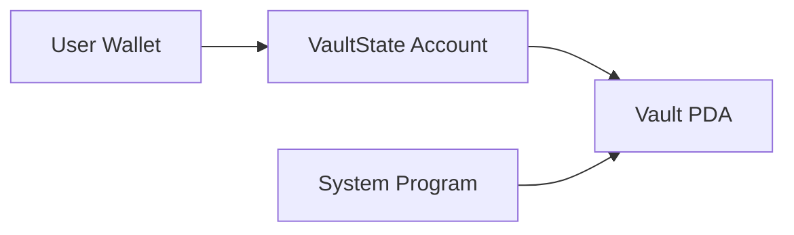

# Solana Vault Program

A secure, user-specific vault system built on Solana using the Anchor framework. This program allows users to create personal vaults for depositing, withdrawing, and managing SOL tokens through Program Derived Addresses (PDAs).

## Table of Contents

- [Solana Vault Program](#solana-vault-program)
  - [Table of Contents](#table-of-contents)
  - [Program ID](#program-id)
  - [Overview](#overview)
  - [Architecture](#architecture)
  - [Instructions](#instructions)
    - [Initialize](#initialize)
    - [Deposit](#deposit)
    - [Withdraw](#withdraw)
    - [Close](#close)
  - [Security Features](#security-features)
  - [Testing](#testing)
    - [Running Tests](#running-tests)
  - [Technical Details](#technical-details)
    - [Account Space Calculation](#account-space-calculation)
    - [Cross-Program Invocation (CPI)](#cross-program-invocation-cpi)
    - [PDA Signing](#pda-signing)
  - [Development Setup](#development-setup)
  - [Usage](#usage)
    - [Initialize Vault](#initialize-vault)
    - [Deposit SOL](#deposit-sol)
    - [Withdraw SOL](#withdraw-sol)
    - [Close Vault](#close-vault)
  - [Technical Design](#technical-design)
    - [Account Structure](#account-structure)
    - [Key Components](#key-components)
  - [License](#license)
  - [Contributing](#contributing)

## Program ID

Devnet: [DSr9tqWZo25DRFKvGCmgwZiAGbfGjmDgXCWUfjWDMg2p](https://explorer.solana.com/address/DSr9tqWZo25DRFKvGCmgwZiAGbfGjmDgXCWUfjWDMg2p?cluster=devnet)

## Overview

The Vault program provides a simple yet secure way for users to:
- Create a personal vault tied to their wallet address
- Deposit SOL into their vault
- Withdraw SOL from their vault
- Close their vault and recover all funds

Each user gets their own isolated vault created using PDAs, ensuring security and preventing unauthorized access to funds.

## Architecture

The program uses two main PDAs per user:

1. **Vault State PDA**: Stores metadata including bump seeds
   - Seeds: `["state", user_pubkey]`
   - Stores: `vault_bump` and `state_bump`

2. **Vault PDA**: Holds the actual SOL deposits
   - Seeds: `["vault", user_pubkey]`
   - Type: SystemAccount (for holding lamports)

## Instructions

### Initialize

Creates the user's vault state and vault PDAs.

**Accounts:**
- `user`: Signer and payer for account creation
- `vault_state`: PDA to store bump seeds
- `vault`: PDA to hold SOL deposits
- `system_program`: Required for account creation

**Parameters:** None

### Deposit

Transfers SOL from user's wallet to their vault.

**Accounts:**
- `user`: Signer and source of funds
- `vault_state`: PDA containing bump seeds
- `vault`: Destination PDA for SOL
- `system_program`: Required for transfer

**Parameters:**
- `amount`: Amount of lamports to deposit

### Withdraw

Transfers SOL from user's vault back to their wallet.

**Accounts:**
- `user`: Signer and destination for funds
- `vault_state`: PDA containing bump seeds
- `vault`: Source PDA holding SOL
- `system_program`: Required for transfer

**Parameters:**
- `amount`: Amount of lamports to withdraw

### Close

Closes the vault, transferring all remaining SOL to the user and reclaiming rent.

**Accounts:**
- `user`: Signer and destination for funds and rent
- `vault_state`: PDA to be closed
- `vault`: Source PDA holding SOL
- `system_program`: Required for transfer

**Parameters:** None

## Security Features

- **User Isolation**: Each vault is tied to a specific user's public key
- **PDA Security**: Uses Program Derived Addresses to prevent unauthorized access
- **Signer Validation**: All operations require the user's signature
- **Rent Recovery**: Closing the vault returns all rent to the user

## Testing

The program includes comprehensive tests covering all four instructions:

1. **Initialize Test**: Creates vault state and vault PDAs
2. **Deposit Test**: Deposits 2 SOL into the vault
3. **Withdraw Test**: Withdraws 1 SOL from the vault
4. **Close Test**: Closes the vault and recovers all funds

### Running Tests

```bash
yarn test:local
```

## Technical Details

### Account Space Calculation

The `VaultState` struct uses:
- 8 bytes: Anchor account discriminator
- 1 byte: `vault_bump`
- 1 byte: `state_bump`
- **Total**: 10 bytes

### Cross-Program Invocation (CPI)

The program uses CPI to interact with the System Program for SOL transfers:
- **Deposit**: User signs, transfers from user to vault
- **Withdraw**: Vault PDA signs using stored seeds
- **Close**: Vault PDA signs, transfers all lamports to user

### PDA Signing

For withdraw and close operations, the program uses the vault's bump seed to sign on behalf of the PDA:

```rust
let seeds: &[&[u8]] = &[
    b"vault",
    self.user.key.as_ref(),
    &[self.vault_state.vault_bump],
];
```

## Development Setup

1. Install Anchor CLI
2. Clone the repository
3. Install dependencies:
   ```bash
   yarn
   ```
4. Build the program:
   ```bash
   anchor build
   ```
5. Deploy to devnet:
   ```bash
   yarn deploy:devnet
   ```

## Usage

### Initialize Vault
Transaction: [Initialize Vault](https://explorer.solana.com/tx/3tnYruG94t7bJX66L4faGSYHYnZ5QGbh6GJwD9zsiXiW1XmFC17dW5xeoLssZcRhBVXFa7WeDJ8ERofXUpZgDwyr?cluster=devnet)
```typescript
const [vaultStatePDA] = anchor.web3.PublicKey.findProgramAddressSync(
  [Buffer.from("state"), user.publicKey.toBuffer()],
  program.programId
);

await program.methods.initialize()
  .accounts({
    user: user.publicKey,
    vaultState: vaultStatePDA,
    systemProgram: anchor.web3.SystemProgram.programId
  })
  .signers([user])
  .rpc();
```

### Deposit SOL
Transaction: [Deposit SOL](https://explorer.solana.com/tx/3ysBu4s9bAF6VrSBHZaZYj5ZRc7G43MF9C6PaDjFQZaY8zAFs1XZzkzjQL4L8X6cRVAJRfafLisToYUT4ewkH8s3?cluster=devnet)
```typescript
await program.methods.deposit(new anchor.BN(lamports))
  .accounts({
    user: user.publicKey,
    vault: vaultPDA,
    vaultState: vaultStatePDA,
    systemProgram: anchor.web3.SystemProgram.programId
  })
  .signers([user])
  .rpc();
```

### Withdraw SOL
Transaction: [Withdraw SOL](https://explorer.solana.com/tx/5qQGzrCV4tup6yrQwZ5YMfLYFpb6Chd4rcYKWCNMgrJfdu5NuVwEXsVEPVw2N5NSRZDc9Hh9o4vp8aDNvZiwjE68?cluster=devnet)
```typescript
await program.methods.withdraw(new anchor.BN(lamports))
  .accounts({
    user: user.publicKey,
    vault: vaultPDA,
    vaultState: vaultStatePDA,
    systemProgram: anchor.web3.SystemProgram.programId
  })
  .signers([user])
  .rpc();
```

### Close Vault
Transaction: [Close Vault](https://explorer.solana.com/tx/2Bp3u4f27ev4pRgAtqSyk6ZG4HuRwhfVB8ussd1avi38P1dZiM9E7D8E7g23ufpqF7Lnm6LEQzgXsowue9W2mqfS?cluster=devnet)
```typescript
await program.methods.close()
  .accounts({
    user: user.publicKey,
    vault: vaultPDA,
    vaultState: vaultStatePDA,
    systemProgram: anchor.web3.SystemProgram.programId
  })
  .signers([user])
  .rpc();
```
## Technical Design

### Account Structure


### Key Components
1. **VaultState Account**
   - Stores security parameters (vault_bump, state_bump)
   - 10 bytes storage (8 byte header + 2x1 byte bumps)
   - Initialized per-user with PDA derivation

2. **Vault PDA**
   - SOL vault address derived from VaultState key
   - Managed exclusively through program instructions
   - Requires PDA signature for fund movements

3. **Security Model**
   - Dual PDA verification (state + vault)
   - Owner-bound account relationships
   - Secure CPI with program-derived signatures

## License

This project is licensed under the MIT License - see the [LICENSE](LICENSE) file for details.

## Contributing

Contributions are welcome. Please ensure all tests pass and add appropriate test coverage for new features.