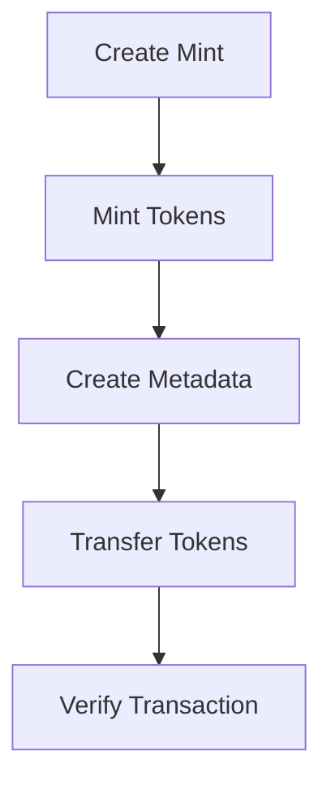
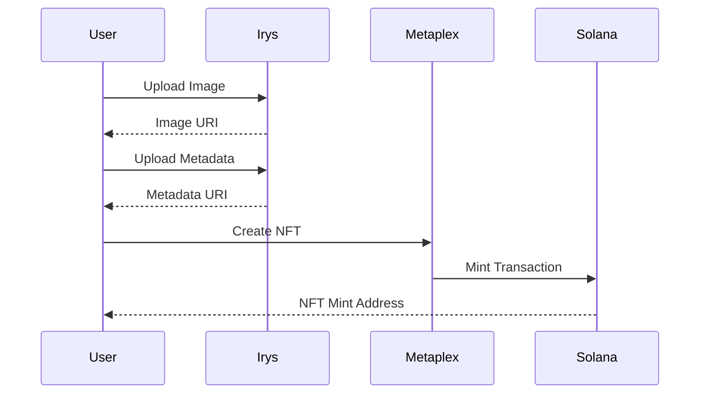
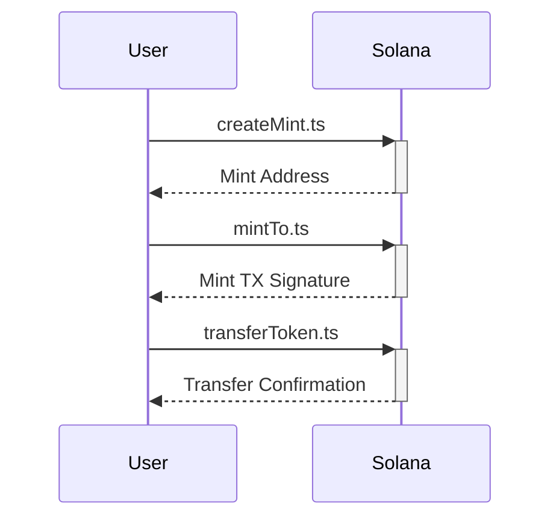
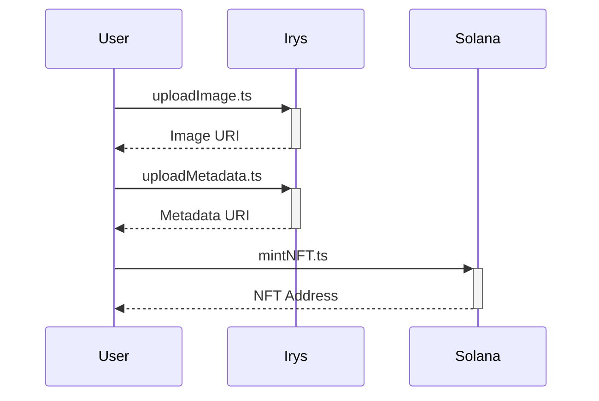

# Solana Token & NFT Minting Suite


## Table of Contents
1. [Project Overview](#project-overview)
2. [Key Features](#key-features)
3. [Technologies Used](#technologies-used)
4. [Prerequisites](#prerequisites)
5. [Installation](#installation)
6. [Configuration](#configuration)
7. [Project 1: SPL Token Management](#project-1-spl-token-management)
8. [Project 2: NFT Creation Pipeline](#project-2-nft-creation-pipeline)


## Project Overview <a name="project-overview"></a>

This repository contains two distinct but complementary Solana blockchain projects:

1. **SPL Token Management System**
   - Full lifecycle management of custom tokens
   - Features mint creation, token issuance, transfers, and metadata handling
   - Implements Token Program and Associated Token Accounts (ATA)

2. **NFT Creation Pipeline**
   - End-to-end NFT creation workflow
   - Includes image/metadata upload to Arweave via Irys
   - Metaplex-compliant NFT minting with dynamic attributes

Both projects demonstrate professional-grade Solana development practices using modern tooling from the Solana ecosystem.

## Key Features <a name="key-features"></a>

**SPL Token System**
- Mint creation with configurable decimals
- Token minting to specific wallets
- Cross-wallet token transfers
- Token metadata management (ERC-1155 style)
- Comprehensive error handling

**NFT Pipeline**
- Decentralized asset storage via Arweave/Irys
- Dynamic metadata generation
- Metaplex NFT standard compliance
- Creator royalty configuration
- Image optimization and upload
- Devnet deployment ready

## Technologies Used <a name="technologies-used"></a>

| Technology             | Purpose                       | Version |
| ---------------------- | ----------------------------- | ------- |
| Solana Web3.js         | Core Blockchain Interactions  | ^1.86.0 |
| SPL Token              | Token Standard Implementation | ^0.3.8  |
| Metaplex Foundation    | NFT Metadata Management       | ^0.23.0 |
| Irys (Formerly Bundlr) | Decentralized File Storage    | ^0.8.0  |
| TypeScript             | Type-safe Implementation      | ^4.9.5  |
| bs58                   | Base58 Encoding/Decoding      | ^5.0.0  |

## Prerequisites <a name="prerequisites"></a>

1. Node.js v18.16.0+
2. Solana CLI v1.16.0+
3. TypeScript v4.9.5+
4. Devnet SOL (Use Solana CLI: `solana airdrop 2`)
5. Linux/MacOS environment (Windows WSL2 supported)

## Installation <a name="installation"></a>

```bash
# Clone repository
git clone https://github.com/your-org/solana-token-nft-suite.git
cd solana-token-nft-suite

# Install dependencies
npm install @solana/web3.js @solana/spl-token \
@metaplex-foundation/mpl-token-metadata \
@metaplex-foundation/umi-bundle-defaults \
bs58 @coral-xyz/anchor

# Configure Solana CLI
solana config set --url https://api.devnet.solana.com
```

## Configuration <a name="configuration"></a>

1. **Wallet Setup**
   - Place your wallet JSON file at `./cluster1/wallet/Turbin3-wallet.json`
   - Ensure proper file permissions: `chmod 600 ./cluster1/wallet/*`
   
2. **Environment Variables**
   ```env
   # .env file
   RPC_ENDPOINT=https://api.devnet.solana.com
   IRYS_NODE=https://devnet.irys.xyz
   TOKEN_DECIMALS=6
   TOKEN_SYMBOL=AXM
   ```

## Project 1: SPL Token Management <a name="project-1-spl-token-management"></a>

### Architecture Overview



### Core Components

1. **createMint.ts**
   - Initializes new token mint on-chain
   - Sets mint authority and freeze authority
   - Example Output: `Mint address: 7E21neTvFFzZAdGwd3VWd8TWDiGVJWiq1qhbyvumvoC6`

2. **mintTo.ts**
   - Creates Associated Token Account (ATA)
   - Mints tokens to specified wallet
   - Implements decimal handling (1,000,000 base units = 1 token)

3. **transferToken.ts**
   - Cross-wallet token transfers
   - Automated ATA creation for recipients
   - Atomic transaction handling

4. **createMetadata.ts**
   - ERC-1155 compatible metadata
   - Configurable royalty structure
   - Immutable metadata options

### Execution Flow

```bash
# Create token mint
ts-node cluster1/scripts/createMint.ts

# Mint initial supply
ts-node cluster1/scripts/mintTo.ts

# Transfer tokens
ts-node cluster1/scripts/transferToken.ts

# Verify transaction
solana confirm -v TRANSACTION_SIGNATURE
```

## Project 2: NFT Creation Pipeline <a name="project-2-nft-creation-pipeline"></a>

### Architecture Overview



### Core Components

1. **uploadImage.ts**
   - Image optimization pipeline
   - Arweave permanent storage
   - MIME type validation

2. **uploadMetadata.ts**
   - ERC-721 compliant metadata
   - Dynamic attribute system
   - Creator royalty management

3. **mintNFT.ts**
   - Metaplex NFT standard implementation
   - Configurable seller fees
   - Cross-program invocation (CPI) handling

### Execution Flow

```bash
# Upload NFT image
ts-node cluster2/scripts/uploadImage.ts

# Create metadata
ts-node cluster2/scripts/uploadMetadata.ts

# Mint NFT
ts-node cluster2/scripts/mintNFT.ts

# Verify NFT
solana account NFT_MINT_ADDRESS
```

**1. SPL Token Factory**  
Create, mint, and transfer custom tokens with metadata management  
**2. NFT Launchpad**  
Full pipeline from image upload to NFT minting with permanent storage

---

## 🔑 Core Features

```ascii
  +-------------------+         +-------------------+
  |  Token Creation   |         |    NFT Minting    |
  +-------------------+         +-------------------+
           |                            |
           v                            v
  +-------------------+         +-------------------+
  |  Mint Management  |         |  Image Uploader   |
  +-------------------+         +-------------------+
           |                            |
           v                            v
  +-------------------+         +-------------------+
  | Token Transfers   |         | Metadata Builder  |
  +-------------------+         +-------------------+
           |                            |
           v                            v
  +-------------------+         +-------------------+
  |  Metadata Setup   |         |  NFT Creator      |
  +-------------------+         +-------------------+
```

---

## 💻 Code Deep Dive

### Project 1: SPL Token System

#### 1. Mint Creation (`createMint.ts`)
```typescript
// Create new token mint
const mint = await createMint(
  connection,
  keypair,             // Authority keypair
  keypair.publicKey,   // Mint authority
  null,                // Freeze authority (disabled)
  6                    // Decimals precision
);
```
**Key Features:**  
- Configurable decimal places (6 = standard for most tokens)
- Granular authority control
- Devnet deployment ready

#### 2. Token Minting (`mintTo.ts`)
```typescript
// Mint to ATA (Associated Token Account)
const mintTx = await mintTo(
  connection,
  keypair,
  mint,                // Our token address
  ata.address,         // Target wallet's ATA
  keypair.publicKey,   // Mint authority
  1_000_000n          // 1 token (1*10^6 for 6 decimals)
);
```
**Why This Matters:**  
- Automated ATA creation if missing
- Precise decimal handling
- Atomic transaction execution

---

### Project 2: NFT Factory

#### 1. Image Uploader (`uploadImage.ts`)
```typescript
// Upload to decentralized storage
const [imageURI] = await umi.uploader.upload([
  createGenericFile(imageBuffer, "nft-image.jpg", {
    contentType: "image/jpeg"  // Ensures proper MIME type
  })
]);
```
**Storage Details:**  
- Permanent Arweave storage via Irys
- Automatic content-type detection
- Batch upload capabilities

#### 2. NFT Minting (`mintNFT.ts`)
```typescript
// Metaplex NFT creation
const tx = createNft(umi, {
  mint: generateSigner(umi),
  name: "CryptoPioneer",
  uri: metadataURI,            // From uploadMetadata
  sellerFeeBasisPoints: 500,   // 5% royalty
  creators: [{ 
    address: keypair.publicKey, 
    verified: true, 
    share: 100 
  }]
});
```
**NFT Specs:**  
- Royalty enforcement
- Creator verification
- On-chain metadata references

---

## 🛠️ Setup Guide

### Installation
```bash
# Clone with NFT starter templates
git clone https://github.com/your-repo/solana-token-nft-suite.git
cd solana-token-nft-suite

# Install core dependencies
npm install @solana/web3.js @solana/spl-token \
@metaplex-foundation/umi-bundle-defaults \
@metaplex-foundation/mpl-token-metadata \
@irys/sdk
```

### Configuration
```typescript
// Common configuration (shared/config.ts)
export const COMMON_SETTINGS = {
  cluster: "devnet",
  commitment: "confirmed",
  rpcEndpoint: "https://api.devnet.solana.com",
  irysNode: "https://devnet.irys.xyz",
  walletPath: "./cluster1/wallet/Turbin3-wallet.json"
};
```

---

## 🏃 Execution Workflow

### Token System Flow


### NFT Pipeline Flow


---

## 📜 Code Explanations

### Token Transfer Mechanism
```typescript
// transferToken.ts
await transfer(
  connection,
  keypair,               // Payer
  fromATA.address,       // Source ATA
  toATA.address,         // Destination ATA
  keypair.publicKey,     // Owner authority
  1_000_000n,            // Amount in lamports
  [],                     // Additional signers
  { commitment: "finalized" }  // Confirmation level
);
```
**Key Considerations:**  
- Both ATAs must exist before transfer
- Token decimals affect amount formatting
- Finalized confirmation ensures transaction irreversibility

### Metadata Structure
```typescript
// Metadata template 
const metadata = {
  name: "Turbin3",
  symbol: "TRB",
  description: "A token representing bullish vibes on the Solana blockchain.",
  image: "https://beige-recent-peafowl-739.mypinata.cloud/ipfs/bafkreia3yxum2nu2syjhntcwvnsz7jgrox4rqaa54fkx3q66cennne36xa/turbine.png",
  seller_fee_basis_points: 0,
  properties: {
    files: [
      {
        uri: "https://beige-recent-peafowl-739.mypinata.cloud/ipfs/bafkreia3yxum2nu2syjhntcwvnsz7jgrox4rqaa54fkx3q66cennne36xa/turbine.png",
        type: "image/png"
      }
    ]
  }
};
```
---

## 📜 License
MIT License - See [LICENSE](LICENSE) for details.

---