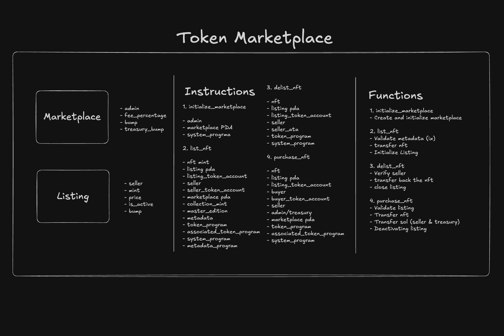

# Solana NFT Marketplace

A decentralized NFT marketplace built on the Solana blockchain using the Anchor framework. This program enables users to list, delist, and purchase NFTs from verified collections with configurable marketplace fees.

## Features

- **Marketplace Management**: Initialize and configure marketplace with customizable fee structures
- **NFT Listing**: List NFTs from verified collections with set prices
- **NFT Delisting**: Remove NFT listings and return NFTs to original owners
- **NFT Purchase**: Buy listed NFTs with automatic fee distribution
- **Collection Verification**: Only verified collection NFTs can be listed
- **Fee Management**: Configurable marketplace fees collected on each sale

## Program Structure



### Core Instructions

- `initialize_marketplace`: Set up the marketplace with admin and fee configuration
- `list_nft`: List an NFT for sale at a specified price
- `delist_nft`: Remove an NFT listing and return it to the seller
- `purchase_nft`: Buy a listed NFT with automatic payment distribution

### State Accounts

#### Marketplace
- `admin`: Public key of the marketplace administrator
- `fee_percentage`: Fee percentage (0-100) charged on each sale
- `bump`: PDA bump for the marketplace account
- `treasury_bump`: PDA bump for the treasury account

#### Listing
- `seller`: Public key of the NFT seller
- `mint`: Mint address of the listed NFT
- `price`: Listing price in lamports
- `bump`: PDA bump for the listing account
- `is_active`: Boolean indicating if the listing is active

## Prerequisites

- Rust 1.70+
- Solana CLI 1.16+
- Anchor CLI 0.28+
- Node.js 16+
- Yarn or npm

## Installation

1. Clone the repository:
```bash
git clone <repository-url>
cd marketplace
```

2. Install dependencies:
```bash
yarn install
```

3. Build the program:
```bash
anchor build
```

4. Deploy to localnet:
```bash
anchor deploy
```

## Usage

### Initialize Marketplace

```typescript
const tx = await program.methods.initializeMarketplace(1) // 1% fee
  .accountsPartial({
    admin: provider.wallet.publicKey,
    marketplace,
    treasury,
    systemProgram: anchor.web3.SystemProgram.programId
  })
  .rpc();
```

### List NFT

```typescript
const tx = await program.methods.listNft(price)
  .accountsPartial({
    seller: seller.publicKey,
    nft: nftMint.publicKey,
    listing,
    listingTokenAccount: vault,
    sellerTokenAccount: sellerAta,
    marketplace,
    collectionMint: collectionMint.publicKey,
    metadata: metadataAccount,
    masterEdition: masterEditionAccount,
    tokenProgram: TOKEN_PROGRAM_ID,
    systemProgram: anchor.web3.SystemProgram.programId,
    associatedTokenProgram: ASSOCIATED_TOKEN_PROGRAM_ID,
    metadataProgram: MPL_TOKEN_METADATA_PROGRAM_ID
  })
  .signers([seller])
  .rpc();
```

### Delist NFT

```typescript
const tx = await program.methods.delistNft()
  .accountsPartial({
    seller: seller.publicKey,
    nft: nftMint.publicKey,
    listing,
    marketplace,
    listingTokenAccount: vault,
    sellerTokenAccount: sellerAta,
    systemProgram: anchor.web3.SystemProgram.programId,
    tokenProgram: TOKEN_PROGRAM_ID,
    associatedTokenProgram: ASSOCIATED_TOKEN_PROGRAM_ID
  })
  .signers([seller])
  .rpc();
```

### Purchase NFT

```typescript
const tx = await program.methods.purchaseNft()
  .accountsPartial({
    buyer: buyer.publicKey,
    seller: seller.publicKey,
    nft: nftMint.publicKey,
    marketplace,
    buyerTokenAccount: buyerAta,
    listingTokenAccount: vault,
    listing,
    treasury,
    systemProgram: anchor.web3.SystemProgram.programId,
    tokenProgram: TOKEN_PROGRAM_ID,
    associatedTokenProgram: ASSOCIATED_TOKEN_PROGRAM_ID
  })
  .signers([buyer])
  .rpc();
```

## Account Derivation

### Marketplace PDA
```
seeds: ["marketplace"]
```

### Treasury PDA
```
seeds: ["treasury", marketplace.key()]
```

### Listing PDA
```
seeds: ["listing", marketplace.key(), seller.key(), nft_mint.key()]
```

## Security Features

- **Collection Verification**: Only NFTs from verified collections can be listed
- **PDA Authority**: NFTs are held in secure PDAs during listing
- **Seller Validation**: Listing seller must match the actual seller
- **Active Listing Check**: Purchases only succeed on active listings
- **Price Validation**: Listing prices must be greater than zero
- **Fee Validation**: Marketplace fees are capped at 100%

## Testing

Run the test suite:

```bash
anchor test
```

The tests cover:
- Marketplace initialization
- NFT listing with collection verification
- NFT delisting
- NFT purchasing with fee distribution

## Error Handling

The program includes comprehensive error handling for:
- Invalid fee percentages
- Invalid listing prices
- Inactive listings
- Math overflow conditions
- Collection verification failures

## Dependencies

- `anchor-lang`: Solana program framework
- `anchor-spl`: SPL token program integration
- `@metaplex-foundation/mpl-token-metadata`: NFT metadata handling
- `@solana/spl-token`: Token program utilities


## Deployment Information

### Devnet
- **Program ID**: [`broQPt5f3vtMniWxwJLeHK5X56pGgor4Qmpd9jMVLYT`](https://explorer.solana.com/address/broQPt5f3vtMniWxwJLeHK5X56pGgor4Qmpd9jMVLYT?cluster=devnet)

### Example Transactions

The following transactions demonstrate the complete vault lifecycle on devnet:

**Initialize Marketplace:**
[`59DDvdKNf8k5LXjTvTgLM8i8vgMCUnC8ELGHDokHFzkMzuEMkUNaSk32SaE8Bgt4aZN5uAtkhKn7gE2CAM78ifME`](https://explorer.solana.com/transaction/59DDvdKNf8k5LXjTvTgLM8i8vgMCUnC8ELGHDokHFzkMzuEMkUNaSk32SaE8Bgt4aZN5uAtkhKn7gE2CAM78ifME?cluster=devnet)

**List NFT 1:**
[`36HVxc5wpheQ6TWtqqmNrRhjpvYj7LHkri67jn58CaKUQ5LmTWfqw5TV8spMtkjinTzBd4U8R3gygyCvyHmVYh2`](https://explorer.solana.com/transaction/36HVxc5wpheQ6TWtqqmNrRhjpvYj7LHkri67jn58CaKUQ5LmTWfqw5TV8spMtkjinTzBd4U8R3gygyCvyHmVYh2?cluster=devnet)

**Delist NFT 1:**
[`2NfktcQSuxTxsS5sCZh3cqSRjAnzQuN9JeyYa2LvPZvZwgCeBEi7rzhB9mXnZpE8W4UHaCqPYK4bbEuCgGsAEuGu`](https://explorer.solana.com/transaction/2NfktcQSuxTxsS5sCZh3cqSRjAnzQuN9JeyYa2LvPZvZwgCeBEi7rzhB9mXnZpE8W4UHaCqPYK4bbEuCgGsAEuGu?cluster=devnet)  

**List NFT 2:**
[`FcYY4bJqmmxfSszBRqE5dRDMr2s9KE1ZvKN3YkZUusHEw1YtqMiNwybRrxG8fyHd62RKqhYy7Nn2Yf3zsfYPtb5`](https://explorer.solana.com/transaction/FcYY4bJqmmxfSszBRqE5dRDMr2s9KE1ZvKN3YkZUusHEw1YtqMiNwybRrxG8fyHd62RKqhYy7Nn2Yf3zsfYPtb5?cluster=devnet)

**Purchase NFT 2:**
[`2tgkqs2jjuBU7yLHGrPL7Bv48WT9qSXChw4JJTQWydEQDvkRTtTCysLntuJKRBHQUY8djcoq4TxHUsbhgEGP8Y5n`](https://explorer.solana.com/transaction/2tgkqs2jjuBU7yLHGrPL7Bv48WT9qSXChw4JJTQWydEQDvkRTtTCysLntuJKRBHQUY8djcoq4TxHUsbhgEGP8Y5n?cluster=devnet)  


## License

This program is provided as-is for educational and development purposes. Use at your own risk in production environments.

## Contributing

Contributions are welcome! Please ensure all tests pass and follow Rust/Anchor best practices.